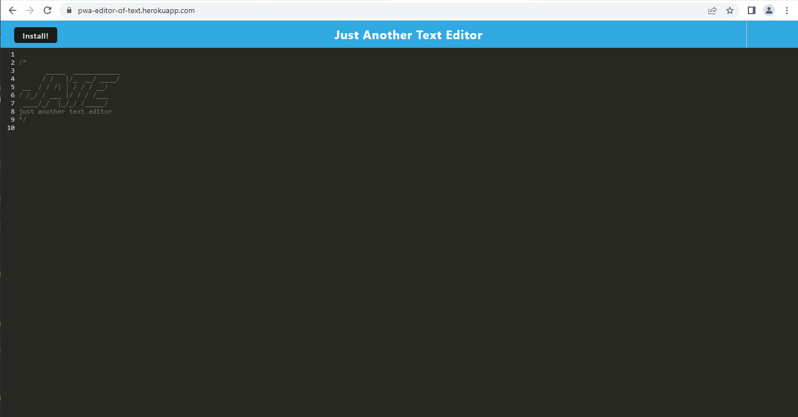

# pwa-text-editor 

## Description

This was a bootcamp challenge to debug and implement algorithms into starter code for a browser-based text editor.  This text editor has default, local, and indexedDB storage, can function once the server is disconnected and be installed independently using service workers to cache data.

## Table of Contents

- [Installation](#installation)
- [Usage](#usage)
- [License](#license)
- [Questions](#questions)

## Installation

Installation isn't required - this app is deployed to Heroku and can be accessed here: https://pwa-editor-of-text.herokuapp.com/

## Usage

To use the app, simply type your text into the text field.  Clicking off of the text field will save your entry in indexedDB and localStorage, whether online or offline.  

## License

MIT License - Please refer to the LICENSE in the repo.

## Questions

You can view my Github @ https://www.github.com/maximusDecimalusMeridius  
OR  
Email me with questions @ [andygg_dev@yahoo.com](mailto:andygg_dev@yahoo.com?subject=Question%20About%20pwa-text-editor%20App)
    